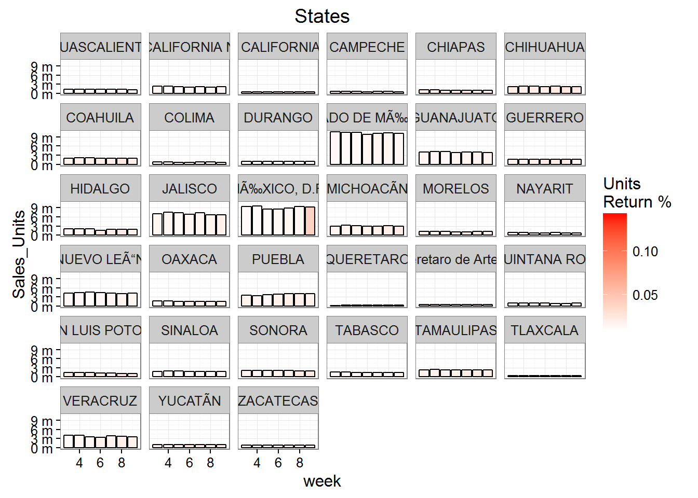
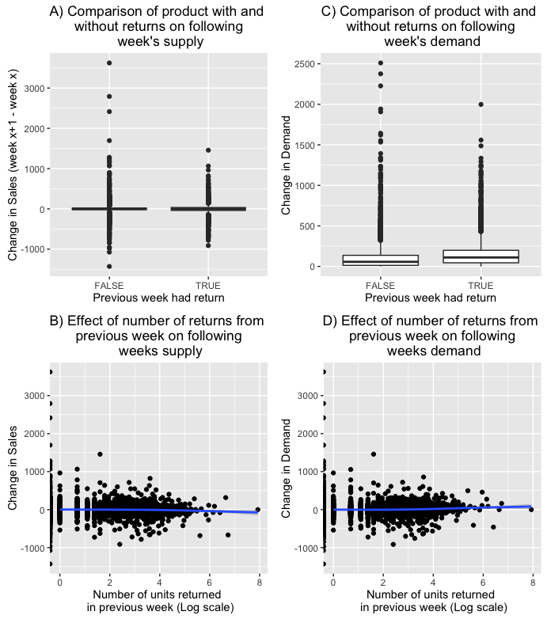
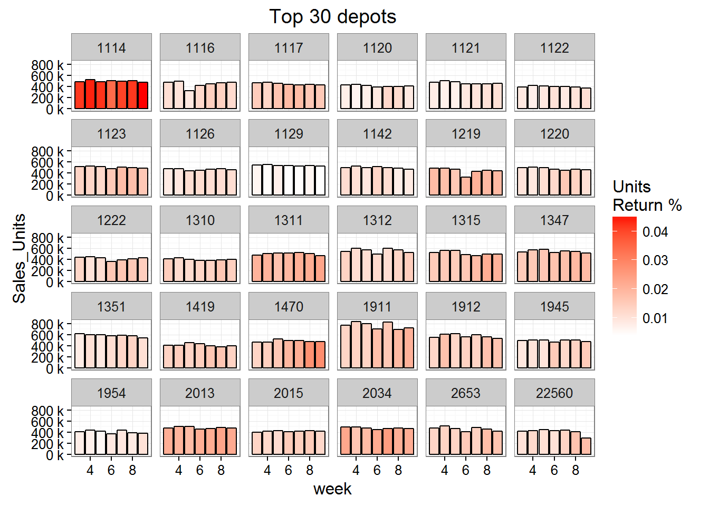
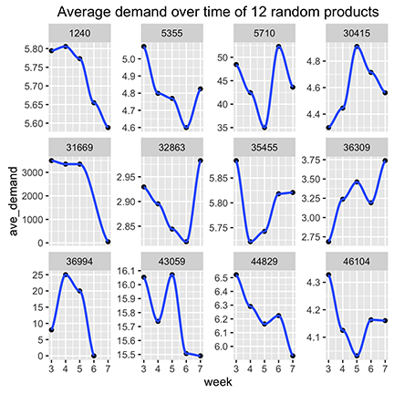

# Grupo Bimbo Technical Report

## Project Overview

Our client, Grupo Bimbo, wants to develop a model to accurately forecast inventory demand based on the historical sales data they collect. Grupo Bimbo is a large bakery store chain that has more than 2500 products spanning over one million stores. Their goal is to meet the product demand for their customers while minimizing unsold surplus. Our group is tasked to create a model to accurately forecast inventory demand based on the historical sales data provided. Creating a successful model will give each of the 1 million stores the ability to accurately request the appropriate amount of each bakery product on a weekly basis.
  Grupo Bimbo's current model for estimating demand is purely human estimated. Managers estimate demand from the sales of products and their returns and make a judgement for the following week's orders. This 'human' model offers a very high business value for implementing automated machine learning and data science methods to more accurately predict demand. 

### Description of data and competition rules

Grupo Bimbo supplied 9 weeks of historical data in a 3.2Gb csv file with 74,180,464 weekly observations for each product delivery. The features in the training data set, and the features available in the test set are detailed below.  

|Field|Original name |Description|In test set
|----------------|------------|-----------------------|---------|
|week |Semana|Week number (3-9)|+|
|depot |Agencia_ID|Sales Depot ID|+
|channel |Canal_ID|Sales Channel ID|+
|route |Ruta_SAK|Route ID (Several routes / Sales Depot)|+
|client |Cliente_ID|Client or Store ID|+
|product |Producto_ID|Product ID|+
|sales_units |Venta_uni_hoy|Sales units this week|
|sales |Venta_hoy|Sales this week (pesos)|
|returns_units |Dev_uni_proxima|Returns units next week|
|returns |Dev_proxima|Returns next week (pesos)|
|demand|Demanda_uni_equil|Adjusted Demand (sales_units - returns_units)|

  The target variable is ‘Adjusted Demand’, which will be an integer representing the demand of a product, in units. 
  Each model will be evaluated for accuracy using the Root Mean Squared Logarithmic Error (RMSLE). This measure for estimating error will penalize models that under-predict more than a model that over-predicts. 

$$\epsilon = \sqrt{\frac{1}{n} \sum_{i=1}^{n} \big(log(p_i + 1)-log(a_i + 1)\big)^2}$$

Where:

$\epsilon$ is the RMSLE value (score)

$n$ is the total number of observations in the data set,

$p_i$ is the prediction of demand

$a_i$ is the actual demand for $i$

$log(x)$ is the natural logarithm of $x$

  
  Another limitation of this data set is that demand is approximated by subtracting the supply from the following week's return of inventory. This would naturally allow for an accurate estimate of demand when supply is higher than demand, but would not accurately estimate demand in cases where the product is under-supplied. Using RMSLE helps with this in some ways by having a greater cost for under-estimated demand than over-estimated demand. However, this alone would not guarentee accurate model evaluation with true demand. 

### Data Science Plan and Process

 

Our team of data scientists will be using the CRISP method of data science. 
This technical report will mirror the data science steps outlined in CRISP. We primarily used R for the visualization and modeling processes. Version control and collaboration was done by using a [github repository](https://github.com/kahultman/grupo-bimbo), and our code is available there. Communication between group members was primarily using Slack and a weekly Google Hangouts video conference. 

## Data Exploration 1

During the initial data exploration step, each of us independently explored the data using summary statistics and visualizations. 

### Goals for the Kaggle competition versus actual client work

Since our project was based off of a Kaggle competition, it is worth pointing out how the competition rules shaped and limited our approach to the project. If our project were a real-world situation, our model would be deployed to predict demand for Grupo Bimbo's products and we would be able to evaluate how well our predicted demand matched the actual demand for the products based on the number of returns the company observed following deployment. For example if our model predicted an increase in demand for product #384 at store #1381 from 15 units to 20 units, Grupo Bimbo would increase the sales to that store and record the number of returned units the following week. However, since both the train and the test data sets are historical, the actual recorded demand is based off of sales without deploying our model. In other words, the cake is already baked and the record for demand is actually based in part on the current human model of demand.  

Only 3% of weekly product sales involve any returned products. If the human model is responsive to these returns we expect to see a drop in the following week's deliveries. However, as Figure 1A and 1B show, it looks like the human model is not responsive to a product with returns or the number of returned units. We consider this beneficial for our purposes because we can estimate actual demand rather than attempt to predict the behavior of the current human model. There is an effect on actual demand however (Fig 1C, 1D), so there is a small benefit to be gained by incorporating returns within our models. 

After model implementation, products should be intentionally overstocked if the product's demand is evaluated by data with no returns. We also noticed that returns were possibly a result of particular depots over estimating demand. 

## Modelling 1: Persistant Baseline Model

Before implementing various machine learning methods we created a baseline model designed to predict demand based on minimal data and simulating the description of the human model currently in place at Grupo Bimbo. In this model, demand is assumed to remain unchanged from the previous week. In the case where a product/client combination is new or there is a newly released product, demand is predicted to be the overall mean demand.

Persistant Baseline Model: Demand(week^x^) = Demand(week^x-1^)

RMSLE: 0.63813

## Data Exploration 2

## Modelling 2: Conditional Medians

Our initial thought was to interpret the data as a time series. The first problem with this was the short time period did not allow for seasonality determination. While there might be some trends in the change of demand over these short weeks, given the lack of response to demand from the current human model, most of the changes over this short time period is likely to be error rather than true trend. Thus, our first model to improve the baseline will aggregate demand across all time points for each feature in the model. 

The first model is really not a model in the traditional sense. This model will simply take the median demand for particular attribute combinations and use that to predict future demand for those attribute combinations. The first model predicts demand by taking the median demand for each product-client pair. For instances where the product-client pair is in the test set but not available in the training set (such as instances where a client first orders a product during the test weeks) we predict demand by the median demand for that product at other clients. In the case where there is a new product we predict demand by the overall median demand for all products. 

### Conditional Medians 1
1. Demand = median {PC}
2. Demand = median {P}
3. Demand = median all products

RMSLE score of 0.50941

The above model is specific to each store and product, however, one client may receive deliveries from more than one shipping depot. The second Conditional Medians model is even more specific for its first prediction, and predicts demand for each product-client-depot instance. This specificity is at the finest grain of the data set, there is only one instance for each week in this grouping. 

### Conditional Medians 2
1. Demand = median {PCD}
2. Demand = median {PC}
3. Demand = median {P}
4. Demand = median all products

RMSLE score of 0.50922

This specificity improves the overall RMSLE score slightly. This improvement likely improves predictions for the larger clients and allows particular depots to predict demand they are responsible for delivering.

### CLRM: Conditional Linear Regression of Means

Our next model is a more complex version of the conditional medians model with two major additional changes. The first is that for the most specific cases where product, client, and depot are all a match, we implement a linear regression model that includes a component for the specific case as well as for the more general case of product and route. The second modification involves transforming our target variable from demand to the logarithm of demand plus 1. 

1. $log(Demand)$ = 0.9994$log(\mu{PCD})$ + 1.094e-03$log(\mu{PR})$ - 7.672e-04 
2. $log(Demand)$ = $log(\mu{PR})$ - 6.153e-13$log(\mu{P})$ + 6.785e-10
3. $log(Demand)$ = $log(\mu{P})$
4. $log(Demand)$ = $log(\mu{all})$

RMSLE score of 0.48943

This model improves our evaluation metric substantially and brings us below 0.5 on the RMSLE score. 

## Feature Engineering

Thus far we have been creating models with features available from the raw data set. In order to gain additional information, we next considered feature engineering to define new fields. We were able to extract the below features from the given data sets.

1. Product Brand
2. Product Weight
3. Product number of pieces
4. Lag demand 1: demand last week
5. Lag demand 2: demand two weeks ago
6. Lag demand 3: demand three weeks ago

## Modelling 3: XGBoost

The next model we started to develop is an Extreme Gradient Boosting (XGBoost) model – which has become one of the most popular algorithms to use for Kaggle competitions.  This algorithm is a combination of both a linear model and decision tree algorithm, which supports objective functions including regression, classification, and ranking. 

XGBoost only works with numeric vectors, so the biggest effort is preparing the data in order for it to run properly.  This included joining additional indicator variables to the train dataset from the other datasets provided and creating lag demand variables.  Our goal was to have the model include: demand, lag of demand, weight, pieces, and brand.

The unexpected issue that we ran into was the difficulty of getting the data properly prepared; this turned into a much more difficult task than anticipated.  To turn character variables into numeric, we first tried using a spread function, which transposes the possible outputs of a character variable into individual binary variables.  Unfortunately, this command was not producing the output desired and, in turn, gave us unusable data to run the model.  With limited time, we decided to only use the already numeric variables.  With more time, our next idea was the use one hot encoding, which makes a sparse matrix using flags on every possible value of that variable.

## Suggestions to Grupo Bimbo for further data mining value

* Longer historical records would allow for detection of seasonality and long term trends
* Clustering on products - Currently if a new product is in the test set, we have to use the overall product average in the CLRM model. If we had products clustered by product attributes and similar demand patterns, we could improve predictions for newly released products. 
* Clustering or categorization of clients - 
