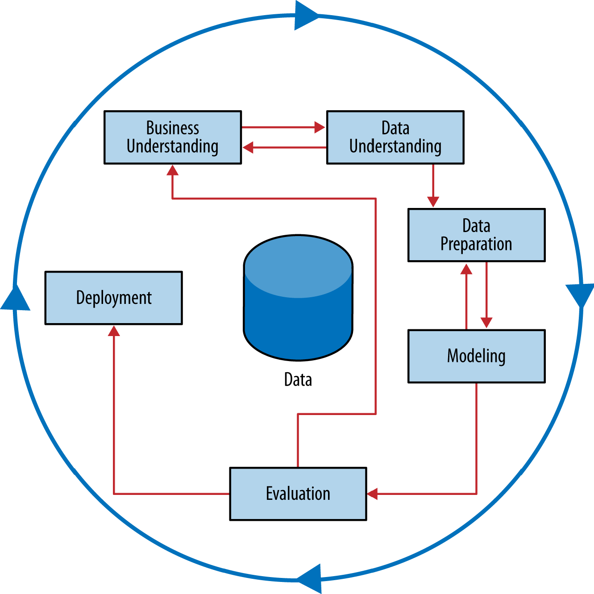

```{r setup, include=FALSE}
library(tufte)
library(dplyr)
library(ggplot2)
# invalidate cache when the tufte version changes
#knitr::opts_chunk$set(tidy = FALSE, cache.extra = packageVersion('tufte'))
#options(htmltools.dir.version = FALSE)
```

# Grupo Bimbo Technical Report

## Outline
- Overview of Project
    - Project Goal
    - Description of data available
    - Baseline Model
    - RMSLE: 
  
- Data Exploration 1
    - Time trends
    - 
- Modelling 1: Time Series
    - Demand ~ Week, for each Product/Client/Depot
    - RMSLE:
- Data Exploration 2
    - Time factor is primarily noise - focus on non-time factors
    -
- Modelling 2: Conditional Means
    - Mean vs Median vs Mean(log+1)
    - Conditional means
    - RMSLE:
    - CLRM - Conditional Linear Regression of Means
    - RMSLE:
  
- Feature engineering
    - Brand
    - Weight
    - Lag
    - 
- Modelling 3: XGBoost

- Ensemble of CLRM and XGBoost

- Implementation of final Grupo Bimbo Demand Prediction model

## Project Overview

Our client, Grupo Bimbo, wants to develop a model to accurately forecast inventory demand based on the historical sales data they collect. Grupo Bimbo is a large bakery store chain that has more than 2500 products spanning over one million stores. Their goal is to meet the product demand for their customers while minimizing unsold surplus. Our group is tasked to create a model to accurately forecast inventory demand based on the historical sales data provided. Creating a successful model will give each of the 1 million stores the ability to accurately request the appropriate amount of each bakery product on a weekly basis.
  Grupo Bimbo's current model for estimating demand is purely human estimated. Managers estimate demand from the sales of products and their returns and make a judgement for the following week's orders. This 'human' model offers a very high business value for implementing automated machine learning and data science methods to more accurately predict demand. 

### Description of Data

Grupo Bimbo supplied 9 weeks of historical data that includes store and product ID, sales, returns, and demand by week. 

The target variable is ‘Adjusted Demand’, which will be an integer representing the demand of a product, in units. 

### Data Science Plan and Process

Our team of data scientists will be using the CRISP method of data science.  
This technical report will mirror the data science steps outlined in CRISP. Our team decided to primarily use R for the visualization and modeling processes. We collaborated by using a [git repository](https://github.com/kahultman/grupo-bimbo), and our code is available there. Communication between group members was primarily using Slack and a weekly Google Hangouts video conference. 

Each model will be evaluated for accuracy using the Root Mean Squared Logarithmic Error (RMSLE). This measure for estimating error will penalize models that under-predict more than a model that over-predicts. 

## Data Exploration 1

During the initial data exploration step, each of us independently explored the data using summary statistics and visualizations. 

### Competition vs IRL Dichotomy

In the proposed real-world situation, our model would be deployed to predict demand for Grupo Bimbo's products and we would be able to evaluate how well our predicted demand matched the actual demand for the products based on the number of returns the company observed. If our model predicted an increase in demand for product 384 at store 1381 from 15 units to 20 units, Grupo Bimbo would increase the sales to that store and record the number of returned units the following week. However, since both the train and the test data sets are historical, the cake is already baked and the record for demand is actually based in part on the current human model of sales. 

### The ideal: An A/B experiment to determine actual demand.

A primary limitation of this data set is that demand is approximated by subtracting the supply from the following week's return of inventory. This would naturally allow for an accurate estimate of demand when supply is higher than demand, but would not accurately estimate demand in cases where the product is under-supplied. 

Using RMSLE helps with this in some ways by having a greater cost for under estimated demand than over estimated demand. However, this alone would not guarentee accurate model evaluation with true demand. 

After model implementation, products should be intentionally overstocked if the product's demand is evaluated by data with no returns. 


```{r}
setwd("/Volumes/Half_Dome/datasets/grupo-bimbo/")
#load("train1.Rdata")


```

Suggestions to Grupo Bimbo for further 

* Better Data Collection
